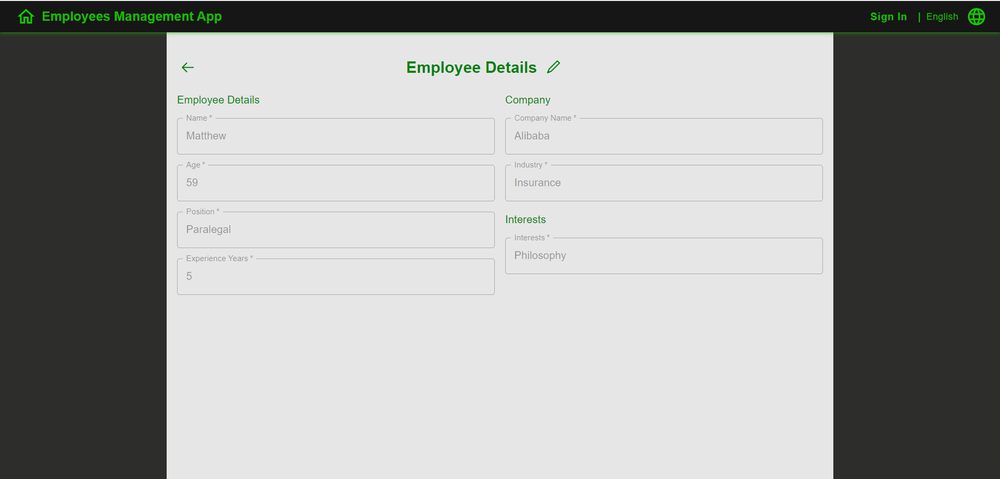

**Project Name: Frontend Task**

**Description:**
This project is a frontend implementation for managing companies and employees, built upon the ui-base-app-next template. It provides functionality for viewing a list of companies and employees, accessing detailed information about each entity, editing and creating entities, as well as filtering and pagination.

**Features:**
1. **List of Entities:**
    - Displays basic fields of each entity (e.g., name, industry for companies; name, age, position for employees).
    - Clicking on an entity navigates to the "Entity Details" page.
    - Includes an "Add Entity" button to navigate to the "Entity Details" page in edit mode.
    - Provides a filter button with multiple filter fields for refining the entity list.
    - Implements pagination for the entity list.
    - Persists filter and pagination settings on page reload.

2. **Entity Details Page:**
    - Displays entity information in two modes: "View" and "Edit".
    - By default, opens in "View" mode, showing all entity fields and an edit button.
    - Clicking the edit button switches to "Edit" mode, allowing the user to modify entity fields.
    - In "Edit" mode, includes "Save" and "Cancel" buttons. Clicking "Save" sends edited fields to the backend. Success or error messages are displayed accordingly.
    - Provides field validation upon clicking "Save". Invalid fields are highlighted, and the request is sent only if all fields pass validation.
    - Clicking "Cancel" in edit mode reverts the entity back to its original state in "View" mode.
    - When creating a new entity, the page opens directly in "Edit" mode with "Create" and "Cancel" buttons. Clicking "Create" initiates the same process as editing an existing entity.
    - Includes a "Back" button for returning to the entity list page. Filter and pagination settings remain intact.

1. List of Employees:

2. Employee Details Page:
   - Employee Details(View Mode):
   
   - Employee Details(Edit Mode):

**Usage:**
1. Clone this repository to your local machine.
2. Build and Run: Build and run the application using Maven or your preferred IDE.

**Screenshots:**

**License:**
This project is licensed under the MIT License. See the [LICENSE](LICENSE.md) file for details.

**Developed by Maksym Chalyi in 2024.**
